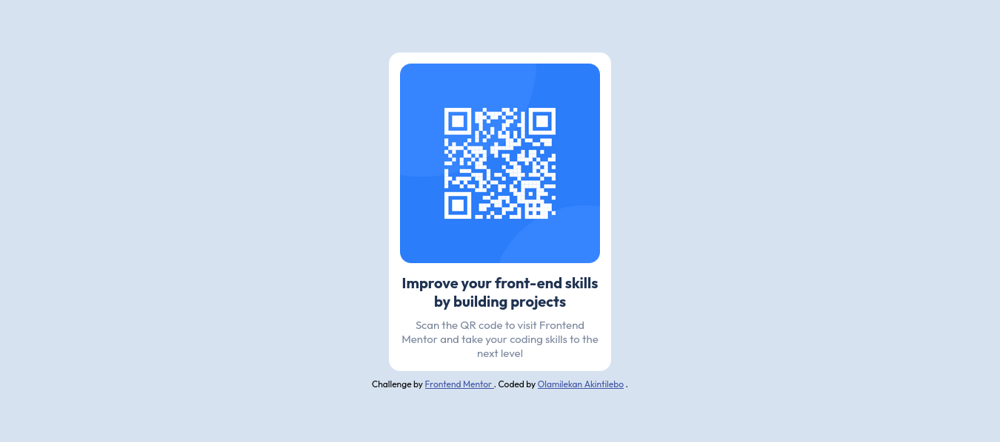

# Frontend Mentor - QR code component solution

This is a solution to the [QR code component challenge on Frontend Mentor](https://www.frontendmentor.io/challenges/qr-code-component-iux_sIO_H). Frontend Mentor challenges help you improve your coding skills by building realistic projects.

## Table of contents

- [Overview](#overview)
  - [Screenshot](#screenshot)
  - [Links](#links)
- [My process](#my-process)
  - [Built with](#built-with)
  - [What I learned](#what-i-learned)
  - [Continued development](#continued-development)
  - [Useful resources](#useful-resources)
- [Author](#author)

## Overview

### Screenshot

### Links

- Solution URL: [Source code](https://github.com/hayohtee/qr-code-component)
- Live Site URL: [Live site](https://hayohtee.github.io/qr-code-component/)

## My process

### Built with

- HTML5 markup
- CSS custom properties
- FlexBox

### What I learned

I learned how to layout a webpage using CSS FlexBox and also add responsiveness to webpage
using CSS media query. Then i found another way to add responsiveness without using media query.

### Continued development

I want to explore the following areas for my continuous development:

- CSS Grid
- Responsive layout
- JQuery

### Useful resources

- [Media Query CSS Example](https://www.freecodecamp.org/news/media-query-css-example-max-and-min-screen-width-for-mobile-responsive-design/) - This is an amazing article which helped me understand how to add responsiveness to webpage using CSS media query.

## Author

- Github - [Olamilekan Akintilebo](https://github.com/hayohtee)
- Frontend Mentor - [@hayohtee](https://www.frontendmentor.io/profile/hayohtee)
- Twitter - [@hayohtee](https://www.twitter.com/hayohtee)
